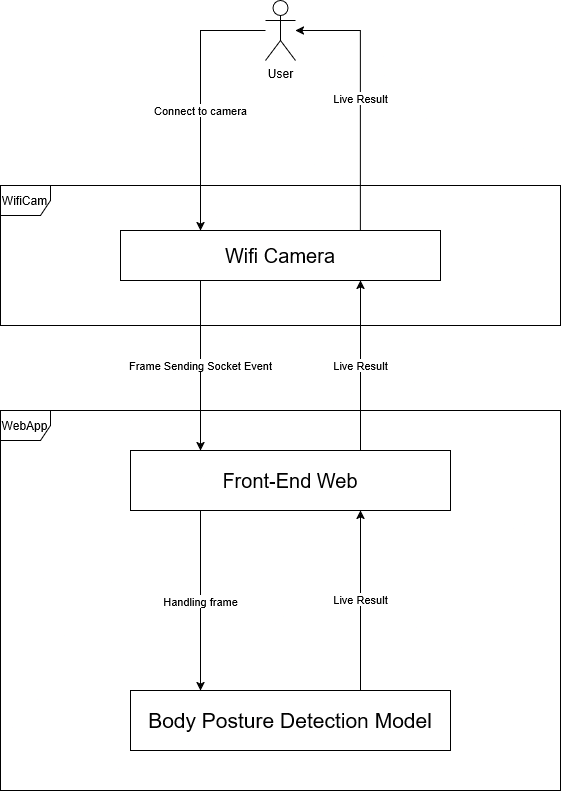

# PBL5 - Body Posture Detection

## 1. Overview

PBL5 is a comprehensive body posture detection system that helps users identify and correct poor posture in real-time. The system consists of three main components: a Python-based backend API for posture detection, a React Native mobile application for user interaction, and an Arduino-based ESP32-CAM hardware module for camera streaming and audio feedback.

## 2. Tech Stack

- **Backend API**: Python (FastAPI), MongoDB, MediaPipe, TensorFlow
- **Mobile App**: React Native (Expo), TypeScript
- **Hardware**: ESP32-CAM, DFPlayer Mini (Audio Module)
- **Communication**: WebSockets, REST API, WiFi

## 3. Project Structure

- `/bdpApi`: Backend API for posture detection and analytics
- `/MobileApp`: Mobile application for user interaction
- `/arduino`: ESP32-CAM firmware for camera streaming and audio alerts

## 4. Setup Instructions

### Hardware Setup (ESP32-CAM)

1. **Hardware Requirements:**
    - ESP32-CAM module
    - DFPlayer Mini audio module
    - MicroSD card (for audio files)
    - Speaker or headphones

2. **Wiring Configuration:**
    - DFPlayer RX → GPIO15 (ESP32-CAM TX)
    - DFPlayer TX → GPIO14 (ESP32-CAM RX)
    - Connect speaker to DFPlayer audio output

3. **Upload Arduino Code:**
    ```bash
    # Open PBL5hardware.ino in Arduino IDE
    # Configure WiFi credentials in the code:
    const char* ssid = "Your_WiFi_Name";
    const char* password = "Your_WiFi_Password";
    ```

4. **Audio Files Setup:**
    - Copy audio files to microSD card root directory
    - Files should be numbered: 001.mp3, 002.mp3, etc.

5. **Upload and Test:**
    - Upload the code to ESP32-CAM
    - Camera server will be available at: `http://ESP32_IP:80`
    - Audio control server at: `http://ESP32_IP:81`

### Backend API Setup

1. **Prerequisites:**
    - Python 3.8+
    - MongoDB (local or cloud instance)
    - Camera (webcam or ESP32-CAM)

2. **Navigate to API directory:**
    ```bash
    cd bdpApi
    ```

3. **Install dependencies:**
    ```bash
    pip install -r requirements.txt
    ```

4. **Configure settings:**
    ```python
    # Edit app/config.py
    MONGODB_URL = "mongodb://localhost:27017"  # Your MongoDB URL
    DB_NAME = "detection_system"
    
    # ESP32 Configuration
    ESP32_AUDIO_SERVER = "http://192.168.1.180"    # Your ESP32 IP
    ESP32_CAM_SERVER = "http://192.168.1.93:81/stream"  # Your ESP32 camera stream
    ```

5. **Initialize database:**
    ```bash
    python app/database/init_db.py
    # Or use PowerShell script:
    powershell -ExecutionPolicy Bypass -File scripts.ps1
    ```

6. **Start the API server:**
    ```bash
    python main.py
    # Server will run on http://localhost:8000
    ```

7. **Verify installation:**
    - API documentation: `http://localhost:8000/docs`
    - Test WebSocket: `ws://localhost:8000/api/ws`

### Mobile App Setup

1. **Prerequisites:**
    - Node.js 16+
    - Expo CLI
    - Mobile device with Expo Go app or emulator

2. **Navigate to Mobile App directory:**
    ```bash
    cd MobileApp
    ```

3. **Install dependencies:**
    ```bash
    npm install
    ```

4. **Configure API endpoints:**
    ```typescript
    // Edit constants/config.ts
    const ip = "192.168.1.69:8000";  // Your backend API IP:PORT
    
    const config = {
      BASE_URL: `http://${ip}/`,
      API_URL: `http://${ip}/api`,
      CAMERA_URL: `http://192.168.111.93:81/stream`,  // ESP32 camera stream
      SOCKET_URL: `ws://${ip}/api/ws`,
    };
    ```

5. **Start the development server:**
    ```bash
    npx expo start
    ```

6. **Run on device:**
    - Scan QR code with Expo Go app (Android/iOS)
    - Or run on emulator: `npx expo start --android` or `npx expo start --ios`

## 5. Configuration Guide

### Network Configuration

1. **Ensure all devices are on the same network:**
    - ESP32-CAM
    - Backend API server
    - Mobile device

2. **Update IP addresses in configuration files:**
    - ESP32: WiFi credentials in `arduino/PBL5hardware.ino`
    - Backend: ESP32 IPs in `bdpApi/app/config.py`
    - Mobile: Backend IP in `MobileApp/constants/config.ts`

### Camera Configuration

1. **ESP32-CAM Settings:**
    ```cpp
    // In PBL5hardware.ino
    s->set_framesize(s, FRAMESIZE_VGA);  // 640x480 resolution
    s->set_quality(s, 10);               // Image quality (10-63)
    ```

2. **Backend Camera Sources:**
    - Local webcam: `camera_id: 0`
    - ESP32-CAM: `camera_url: "http://ESP32_IP:81/stream"`

### Audio Alert Configuration

1. **Audio files format:** MP3, named as 001.mp3, 002.mp3, etc.
2. **Volume control:** Adjustable via ESP32 web interface
3. **Audio mapping:** Configure in `MobileApp/shared/SharedAssets.ts`

## 6. Development Workflow

- `main`: Stable production branch
- `dev`: Development integration branch
- `dev-api`: Backend API development
- `dev-mobile`: Mobile app development

## 7. System Architecture



**Flow:** Mobile app → Backend API → ESP32-CAM captures video → WebSocket transmission → MediaPipe + TensorFlow posture analysis → Results + audio alerts → User feedback

## 8. Features

- **Real-time posture detection** with MediaPipe and TensorFlow models
- **Multi-camera support** (webcam + ESP32-CAM)
- **Audio feedback** via ESP32 and DFPlayer Mini
- **User authentication** and session management
- **Analytics dashboard** with multiple chart types:
  - Pie charts for posture distribution
  - Bar charts for posture duration
  - Line charts for improvement trends
  - Heat maps for daily patterns
- **Customizable posture labels** and severity levels
- **WebSocket real-time communication**

## 9. API Endpoints

- **Authentication:** `/api/auth/token`, `/api/auth/register`
- **Sessions:** `/api/sessions/`, `/api/sessions/latest`
- **Analytics:** `/api/analytics/distribution`, `/api/analytics/duration`
- **WebSocket:** `/api/ws?client_id=<id>&token=<jwt_token>`

## 10. Troubleshooting

### Common Issues

1. **ESP32-CAM not connecting:**
    - Check WiFi credentials
    - Verify power supply (5V recommended)
    - Check serial monitor for error messages

2. **Camera stream not working:**
    - Ensure ESP32 IP is correct in config files
    - Test camera stream directly: `http://ESP32_IP:81/stream`

3. **WebSocket connection failed:**
    - Verify backend server is running
    - Check JWT token validity
    - Ensure network connectivity

4. **Audio alerts not working:**
    - Check microSD card formatting (FAT32)
    - Verify audio files are properly named
    - Test DFPlayer wiring connections

## 11. Security Notes

- **Change default SECRET_KEY** in `bdpApi/app/core/auth.py` before production
- **Use HTTPS** for production deployments
- **Implement rate limiting** for authentication endpoints
- **Secure WiFi credentials** in ESP32 firmware
- **Enable MongoDB authentication** for production databases

## 12. Performance Optimization

- **Camera resolution:** Balance between quality and processing speed
- **Frame rate:** Adjust based on hardware capabilities
- **Model optimization:** Use TensorFlow Lite for mobile deployment
- **Caching:** Implement JWT token caching
- **Connection pooling:** Use MongoDB connection pooling

